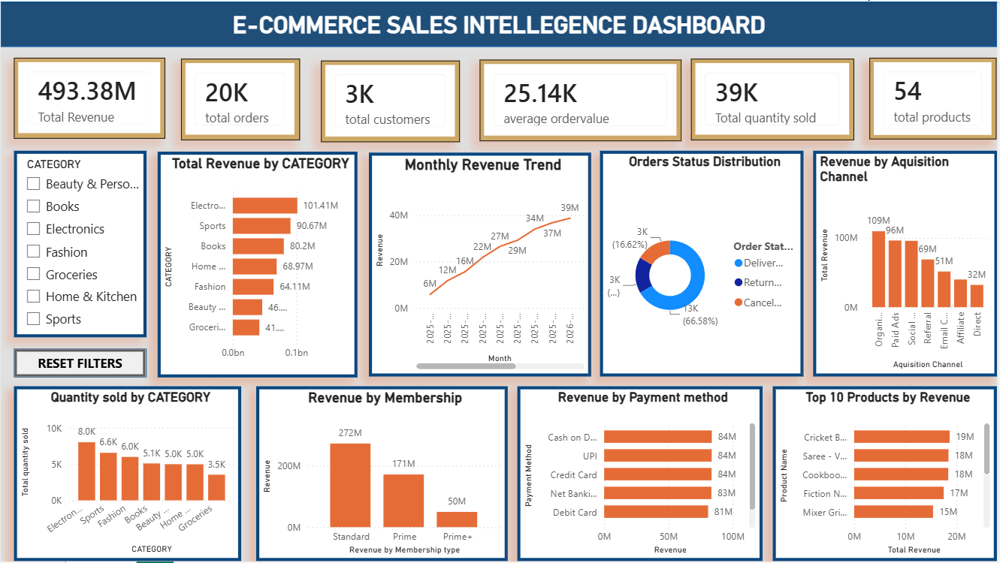

# 📊 E-Commerce Sales Intelligence Dashboard

## Project Overview

The **E-Commerce Sales Intelligence Dashboard** is an end-to-end Business Intelligence project developed using **Microsoft Power BI**. The dashboard provides a comprehensive view of sales performance, customer behavior, product performance, and operational efficiency to support data-driven business decisions.

This project simulates a real-world retail business scenario where management aims to evaluate overall business performance before introducing promotional strategies for high-performing product categories, particularly the **Fashion** category.

---

# Business Problem

An e-commerce retail company observed increasing customer demand for Fashion products and planned to launch promotional campaigns to further increase sales. Before introducing discounts, management required a centralized dashboard to answer key business questions:

* How is the business performing overall?
* Which product categories generate the highest revenue?
* Is Fashion already performing well compared to other categories?
* Which customer segments contribute the most revenue?
* Which acquisition channels bring valuable customers?
* Which payment methods are most preferred?
* How efficiently are customer orders being delivered?

Without a unified reporting solution, these insights were difficult to obtain quickly, making strategic decision-making slower and less effective.

---

# Project Objective

The objective of this project was to build an interactive executive dashboard that enables business stakeholders to:

* Monitor overall sales performance
* Analyze customer purchasing behavior
* Compare product category performance
* Evaluate operational efficiency
* Identify business growth opportunities
* Support strategic promotional decisions through data-driven insights

---

# Dataset

The project uses a retail e-commerce dataset consisting of:

### Orders

* Order ID
* Customer ID
* Product ID
* Order Date
* Quantity
* Unit Price
* Total Amount
* Payment Method
* Order Status
* Delivery Days

### Customers

* Customer Information
* Gender
* Age
* City
* State
* Membership Tier
* Acquisition Channel

### Products

* Product Name
* Category
* Sub Category
* Unit Price

---

# Data Model

A **Star Schema** data model was implemented.

**Fact Table**

* Orders

**Dimension Tables**

* Customers
* Products
* Calendar

The model was designed to improve performance and simplify analytical reporting.

---

# Dashboard Features

The dashboard includes:

* Executive KPI Cards
* Interactive Slicers
* Cross-filtering between visuals
* Reset Filters Button
* Category-wise Revenue Analysis
* Monthly Revenue Trend
* Quantity Sold Analysis
* Revenue by Membership Tier
* Revenue by Payment Method
* Revenue by Acquisition Channel
* Order Status Analysis
* Top Performing Products

---

# Key Performance Indicators (KPIs)

The dashboard measures:

* Total Revenue
* Total Orders
* Total Customers
* Total Products
* Total Quantity Sold
* Average Order Value
* Delivered Orders
* Revenue Contribution (%)
* Revenue per Customer

---

# Business Insights

The dashboard enables management to:

* Identify high-performing product categories
* Evaluate whether Fashion promotions should be introduced
* Analyze customer purchasing patterns
* Identify the most valuable customer segments
* Understand preferred payment methods
* Evaluate operational delivery performance
* Monitor overall business growth

---

# Tools & Technologies

* Microsoft Power BI
* Power Query
* DAX (Data Analysis Expressions)
* Data Modeling
* Star Schema Design
* Interactive Dashboard Design

---

# Dashboard Preview

## Dashboard Preview

## Dashboard Preview

## 📊 Dashboard Preview

---

# Project Highlights

✔ End-to-End Power BI Project

✔ Interactive Executive Dashboard

✔ Business-Oriented Storytelling

✔ Star Schema Data Model

✔ DAX-Based KPI Development

✔ Executive-Level Business Insights

---

# How to Open

1. Download the `.pbix` file.
2. Open it using **Microsoft Power BI Desktop**.
3. Interact with the dashboard using the available slicers and filters.

---

# Author

**Ramyasri Kancharla**

Aspiring Business Analyst | Power BI | SQL | Excel

Thank you for visiting this project. Feedback and suggestions are always welcome.
